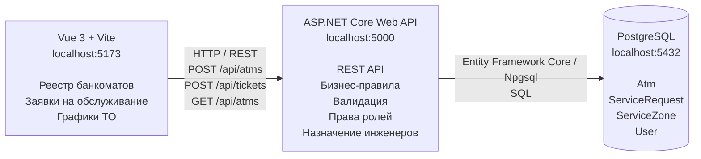

# Архитектура

## Схема

## Подпись

архитектура web-ИС семестра

## Пояснение

Клиент Vue рисует экран реестра банкоматов и графиков ТО и отправляет
HTTP-запросы на ASP.NET Core. Сервер проверяет бизнес-правила
(сроки ТО, допустимые статусы, права ролей) и обращается к PostgreSQL.
Прямой стрелки от браузера к базе нет: иначе клиент получил бы доступ
к данным и обошёл серверные правила (например, назначение инженера
или смену статуса заявки).
